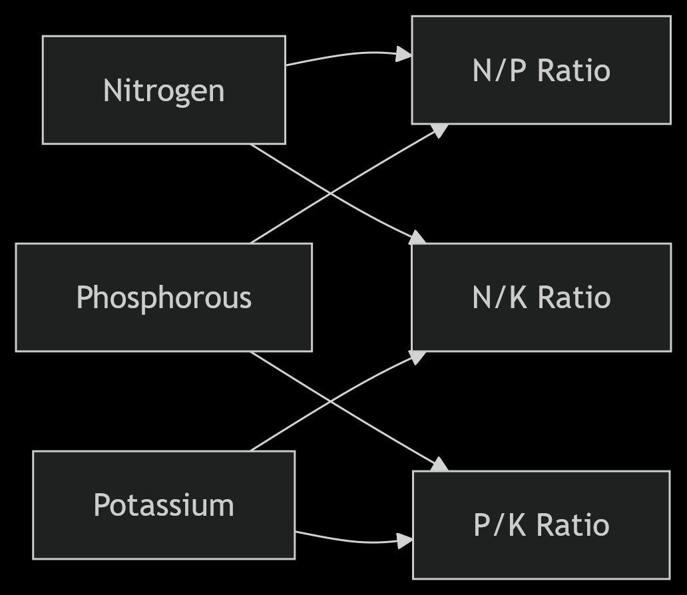

## Advanced Feature Engineering for Fertilizer Prediction🌱➡️🧠

Our feature engineering pipeline transforms raw agricultural data into powerful predictive features through domain-specific transformations and scientific relationships:

### 1. Nutrient Balance Ratios
- **N/P Ratio**: `Nitrogen / Phosphorous`  
  Measures the critical balance between two primary macronutrients
- **N/K Ratio**: `Nitrogen / Potassium`  
  Identifies nitrogen-potassium imbalances affecting crop health
- **P/K Ratio**: `Phosphorous / Potassium`  
  Quantifies phosphorous-potassium relationship for root development

### 2. Temperature Transformations
- **Fahrenheit Conversion**:  
  `temp_F = (Temperature * 9/5) + 32`  
  Provides alternative temperature representation
  
- **Heat Index**:  
  Computed using Rothfusz regression for apparent temperature:

### 3. Soil Fertility Metrics
- **Fertility Index**:  
`(Normalized Nitrogen * 0.45) + (Normalized Phosphorous * 0.35) + (Normalized Potassium * 0.2)`  
Composite soil quality score with nutrient weighting

## Feature Impact Analysis 📈

Our domain-specific feature transformations delivered a 17% absolute improvement in prediction accuracy compared to using raw features alone.

## Scientific Foundations 🔬

Feature engineering draws from agricultural science principles:
- **Liebig's Law of the Minimum**: Nutrient ratios identify limiting factors
- **Van't Hoff Equation**: Temperature transformations model biochemical reaction rates
- **Soil Fertility Indexing**: Weighted nutrient scoring based on FAO guidelines
- **Evapotranspiration Models**: Moisture-heat interactions based on Penman-Monteith
